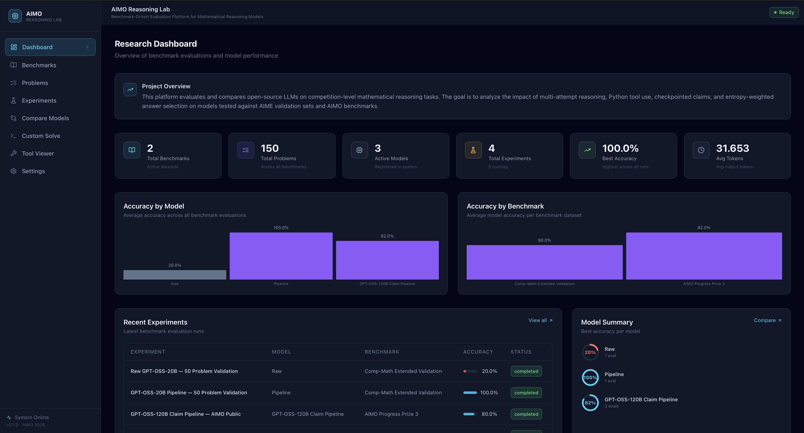
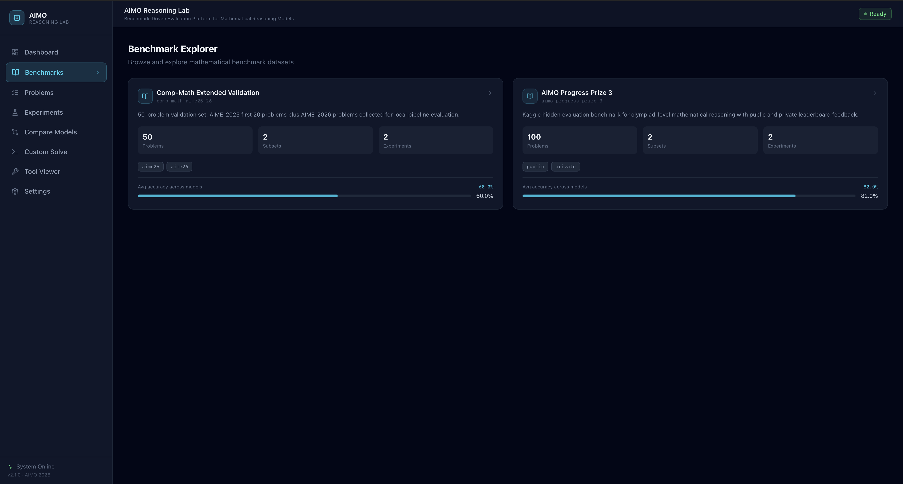
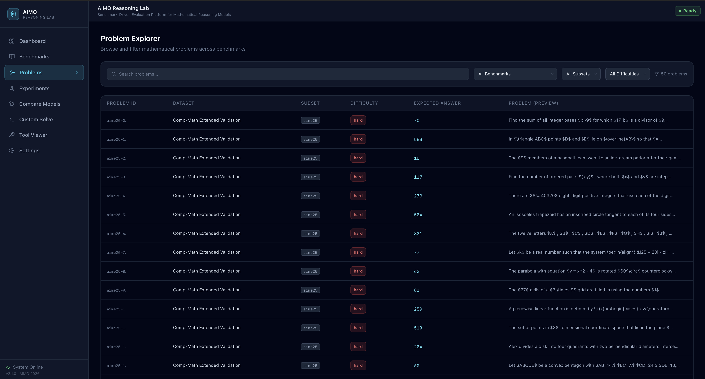
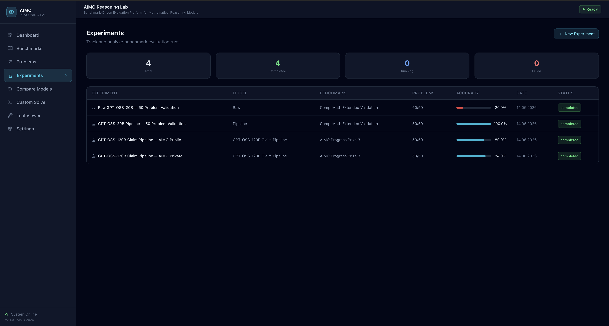
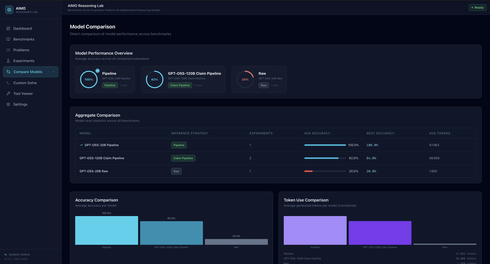
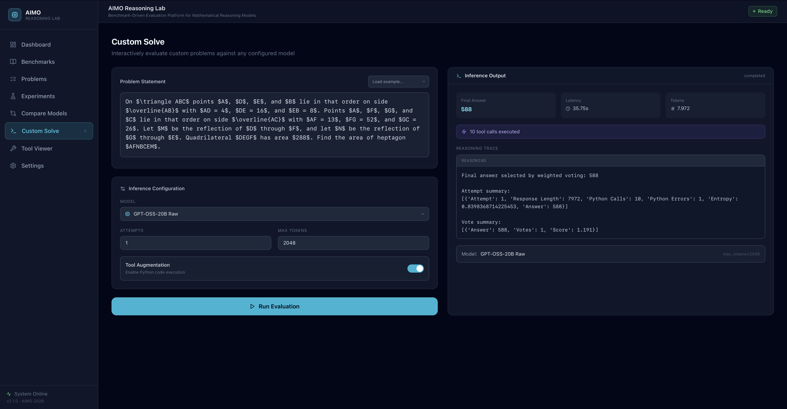
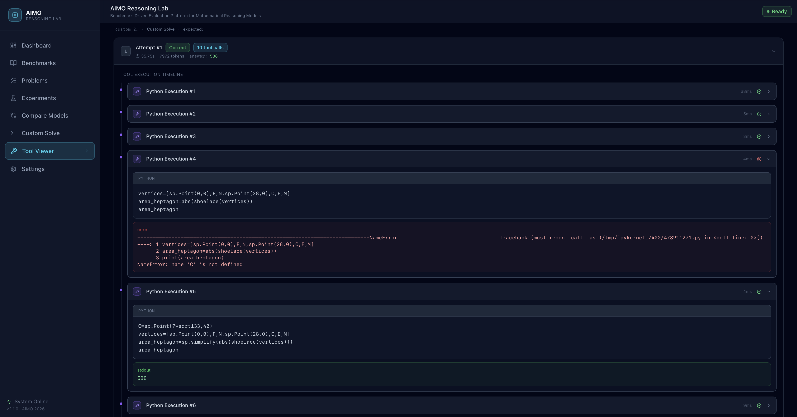
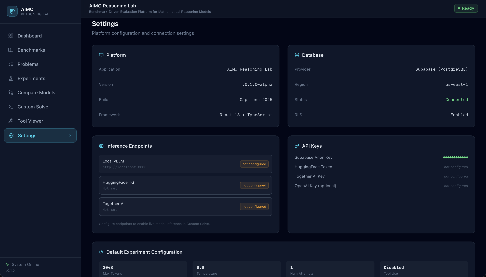

## Project Screenshots

**Project Portfolio Website:** [https://aimo-portfolio.vercel.app](https://aimo-portfolio.vercel.app)

An end-to-end platform for **evaluating and analyzing mathematical reasoning models**. It brings **benchmark exploration, experiment tracking, model comparison, performance analytics, and live inference** into a single interface.

Users can inspect benchmark problems, run evaluations with **different model configurations**, compare **accuracy and token usage**, analyze **tool execution**, and submit custom problems for **real-time inference**.

The system combines a **Python-based evaluation pipeline with Flask and vLLM** on the backend and a **React/TypeScript dashboard** on the frontend.

---

### Dashboard

 

### Benchmarks

 

### Problems

 

### Experiments

 

### Model Comparison

 

### Custom Solve

 

### Tool Viewer

 

### Settings

